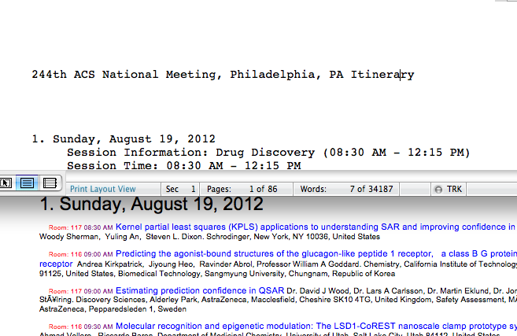

# CleanACSItinerary
This was written sloppily by Dan Sindhikara in a rush
to make his 87-page-long ACS itinerary a bit shorter.

## Requirements
* Python 2.6+
* [PyRTF](http://sourceforge.net/projects/pyrtf/)

## How to use
1. Create an itinerary using ACSs itinerary planner
2. Download the itinerary to .txt format
3. Run cleanACSItinerary.py on the text file:

		python cleanACSItinerary.py <itinerary.txt>
4. Open the .rtf in a document editor and print it

Here's an example:

## Room for improvement

I wrote this program in a rush and I plan to clean it up someday. If you would like to contribute, please make a pull request or issue.

